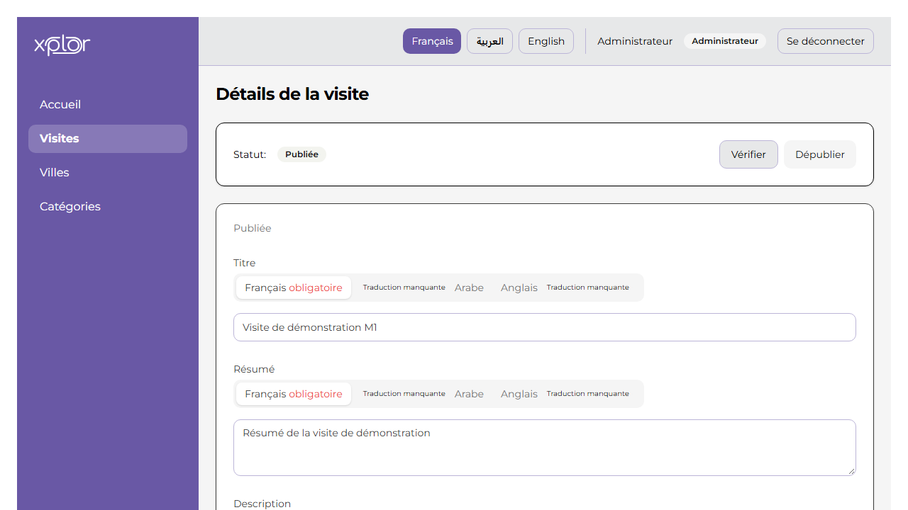

# Démonstration — Jalon M1

## Prérequis
- Environnement démarré (PostgreSQL, Redis, MinIO, Mailpit).
- Base seedée avec les données de démonstration.

## Parcours technique
Étapes du test Playwright rejouables manuellement :
1. Connexion au back-office avec `admin@xplor.local`.
2. Création d'une visite virtuelle : titre "Visite de démonstration M1", ville sélectionnée, catégorie cochée, couverture depuis les assets du seed.
3. Ajout de 3 scènes à la visite avec le titre "Scène X M1" et un panorama du seed.
4. Définition de la Scène 1 comme scène de départ.
5. Création d'un hotspot `SCENE_LINK` (yaw 1.2, pitch 0) de la Scène 1 vers la Scène 2 ("Vers la scène 2").
6. Création d'un hotspot `INFO` sur la Scène 1 avec le libellé "Info M1" et le texte "Ceci est une description détaillée en français.".
7. Création d'un hotspot `SCENE_LINK` de la Scène 2 vers la Scène 3 ("Vers la scène 3").
8. Validation du graphe : toutes les scènes sont atteignables (aucun problème signalé).
9. Publication de la visite avec succès (statut HTTP 200) et la visite passe au statut PUBLISHED.

## Capture d'écran

## Points de vérification
- [ ] La visite en statut PUBLISHED est visible dans la liste.
- [ ] Les 3 scènes sont bien présentes.
- [ ] Les hotspots sont affichés dans l'écran des hotspots.
- [ ] La validation retourne `issues` vide.
- [ ] OpenAPI `/api/v1/openapi.json` accessible.
